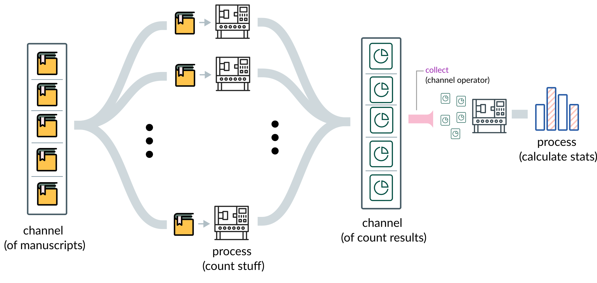

<!-- .slide: data-background="assets/ravi-pinisetti-sxWyOaHJb0s-unsplash.jpg" class="dark no-logo" -->

# A meet and greet with Nextflow

### Christian Diener


Slides: https://dienerlab.github.io/nextflow_intro

<br><br>
<div class="footer">
<a href="https://creativecommons.org/licenses/by-sa/4.0/"><i class="bx bx-cctv"></i>CC BY-SA 4.0</a>
<a href="https://dienerlab.com"><i class="bx bxs-home"></i>dienerlab.com</a>
<a href="https://github.com/dienerlab"><i class="bx bxl-github"></i>dienerlab</a>
<a href="https://twitter.com/thaasophobia"><i class="bx bxl-twitter"></i>@thaasophobia</a>
<a href="https://mstdn.science/@thaasophobia"><i class="bx bxl-mastodon"></i>@thaasophobia</a>
</div>

---

<!-- .slide: data-background="var(--primary)" class="dark" -->

## What is this?

This is not a comprehensive tutorial for the Nextflow language but rather an introduction
and specifics for using Nextflow on the MedBioNode.

- Training: https://training.nextflow.io
- Docs: https://nextflow.io/docs/latest/index.html

---

## The Data Flow paradigm - Workflows as Graphs


A (directed) series of computational or data manipulation steps.

---

## What are workflow management systems (WMSs)

A collection of

- a *language* to express complex workflow graphs
- a *resource manager* that can distribute work automatically
- an *executor* that will run the workflow on a variety of back-ends<br>(SLURM, AWS batch, GCP compute, Kubernetes, local)
- a *monitoring system* that caches results and analyses resource usage

Common WMSs: *Nextflow*, Snakemake, CWL

---

<!-- .slide: data-background="var(--primary)" class="dark" -->

## Problems that are solved by WMSs

You have a complex analysis pipeline that you applied to 1,000 samples already. A
collaborator sends you 10 additional samples. *Which analyses have to be repeated* and
which ones do not?

Your analysis performs many parallel steps on the same inputs (functional annotation, binning, etc).
How do you make sure that all of them run in parallel and are *using the computational resources efficiently*?

Somebody else wants to reproduce your analyses. You ran everything on the MedBioNode with
SLURM and conda but they are using AWS batch with docker containers.
How can they *run your pipeline on very different infrastructure*?

---

### The Nextflow DSL

Nextflow uses a customized *Groovy* to write pipelines (bit of a disadvantage). Actual
analysis steps can be scripts in any language (Bash, Python, R, etc.)

Has a publishing concept (actual output vs. intermediate files).

<br><br>

### The Nextflow CLI

Nextflow is run through a single command line interface - *nextflow* - that is written in JAVA and can be
installed from bioconda for instance.

---
<!-- .slide: data-background="#1e2129" class="dark" -->

## Nextflow Language Abstractions


Channels and processes get composed into a workflow.

---

## Counting words in Shakespeare plays



---

## Let's get cookin'

Login to MedBioNode. You will need conda/mamba there. On your local machine you
would need conda and git.

Setup a nextflow conda environment:

```bash []
conda create -c bioconda -c conda-forge nextflow
```

Get the repository:

```bash []
git clone https://github.com/dienerlab/nextflow_intro
```

Let's have *a look*.

---

## Running the workflow

```bash []
nextflow run main.nf
```

Nextflow can resume a workflow and will figure out what needs to be done again.

```bash []
nextflow run main.nf -resume
```

---

## Parameters

Everything defines within the parameters group in the nextflow workflow can be
passed via the CLI using double dashes.

```bash []
# The default
nextflow run main.nf -resume --what=words

# Count lines rather than words
nextflow run main.nf -resume --what=lines
```

---

## Switching the executor

You can either configure the executor in the nextflow config or directly in the process
definition.

```bash []
nextflow run main.nf -resume -profile slurm
```

---

## Switching the software provider

Nextflow can use several package managers/container engines for software and you can
have even multiple ones for the same pipeline.

```bash []
# Use an existing conda environment (just an example here)
nextflow run main.nf -resume -with-conda "~/miniforge3/envs/metagenomics"

# Use singularity with a docker image from the web
nextflow run main.nf -resume -with-singularity python:3
```

---

## Reporting

Either create an HTML report:

```bash []
nextflow run main.nf -resume -with-report report.html
```

This will look [like this](assets/report.html).

Or use Seqera Cloud (old Nextflow Tower) and track it live.

https://cloud.seqera.io

---

## Specific things for MedBioNode

Use the internal config from the [wiki](https://github.com/dienerlab/.github/wiki)
or the config from [dienerlab/pipelines](https://github.com/dienerlab/pipelines).

Need to adjust the singularity config for isilon.

```text [9]
[...]
    tower {
        workspaceId = "<my-id>"
        accessToken = "<my-token>"
        enabled = false
    }
}

singularity.runOptions = "--no-home -B /home/isilon/users/$USER,/home/gpfs/$USER,$TMPDIR"
```

---

<!-- .slide: data-background="var(--primary)" class="dark" -->

## Where to get pipelines

Public: https://nf-co.re/

<br><br>

### Lab pipelines

https://github.com/dienerlab/pipelines

✓⤫ = optimized for SLURM /
✓✓ = optimized for SLURM and tested on MedBioNode

16S amplicon ✓⤫ <br>
Metagenomics: base ✓✓, binning ✓⤫, replication rates ✓⤫, simulation ✓⤫ <br>
Metatranscriptomics: with MGX ✓⤫, <i>de novo</i> ✓⤫ <br>
Isolates/Strains: assembly + phylo ✓⤫, replication rates ✓⤫ <br>
Genome-scale metabolic model builder ✓⤫
MEDI ✓⤫


---

<!-- .slide: data-background="assets/meduni/bridges.png" -->

# Thanks! :smile:
